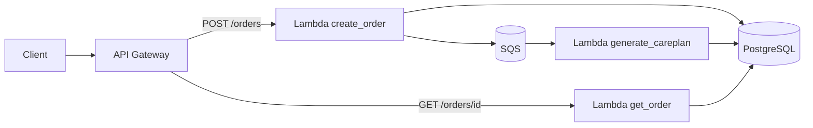

# CarePlan

Backend service that accepts pharmacy care-plan orders, generates plans asynchronously via an LLM, and exposes status for clients to poll.

The same domain logic runs in three shapes:

- **Local / Docker** - Django + Celery + Redis + PostgreSQL
- **AWS practice stack** - API Gateway + Lambda + SQS + RDS (provisioned with Terraform)
- **Kubernetes** - Django -> ExecutionBackend -> CarePlanJob CR -> Go controller -> Kubernetes Job

## Runtime Comparison

| Runtime | Trigger model | Retry owner | Best fit |
| --- | --- | --- | --- |
| Celery | Queue consumption | Celery | local/simple async deployment |
| AWS | Queue/event | SQS/Lambda | serverless AWS deployment |
| Kubernetes | Desired-state reconciliation | Kubernetes Job | Kubernetes-hosted workloads |

## Architecture

Cloud request path (practice infrastructure under `infra/practice/`):



Locally, Celery + Redis play the same role as SQS + the generate worker. Kubernetes is an alternate execution adapter, not a replacement for Celery. See [docs/architecture.md](docs/architecture.md) for detail.

## Infrastructure

Cloud resources are defined as code with **Terraform** in `infra/practice/`:

| Resource | Purpose |
| --- | --- |
| API Gateway (HTTP API) | `POST /orders`, `GET /orders/{id}` |
| Lambda x 3 | create order, generate care plan, get order |
| SQS (+ DLQ) | Async handoff from create -> generate |
| RDS PostgreSQL | Shared persistence |

Apply and destroy from that directory (requires AWS credentials and `TF_VAR_db_password`). Full steps: [docs/deployment.md](docs/deployment.md).

**Cost note:** Practice cloud resources are created only for testing and intentionally destroyed afterward (`terraform destroy`) to avoid ongoing AWS charges. Do not leave the stack running idle.

## Documentation

| Doc | Contents |
| --- | --- |
| [docs/architecture.md](docs/architecture.md) | Backend shape and request flow |
| [docs/deployment.md](docs/deployment.md) | Docker local + Terraform cloud |
| [docs/tradeoffs.md](docs/tradeoffs.md) | Why these choices, limits, next steps |
| [care_plan_design_doc.md](care_plan_design_doc.md) | Product / domain design |
| [CHANGELOG.md](CHANGELOG.md) | Release history |
| [docs/releases/v0.7.md](docs/releases/v0.7.md) | v0.7 release notes |
| [docs/engineering-notes/day15.md](docs/engineering-notes/day15.md) | Day 15 engineering notes |

## Local Run

Terminal 1 (API):

```bash
pip install -r requirements.txt
set POSTGRES_DB=careplan
set POSTGRES_USER=careplan
set POSTGRES_PASSWORD=careplan
set POSTGRES_HOST=localhost
set POSTGRES_PORT=5432
python manage.py migrate
python manage.py runserver 0.0.0.0:8000
```

Terminal 2 (Celery worker):

```bash
celery -A careplan_mvp worker --loglevel=info
```

Open `http://127.0.0.1:8000/`.

The default execution backend is Celery. To set it explicitly:

```bash
set CAREPLAN_EXECUTION_BACKEND=celery
```

## Docker Run

```bash
docker compose up --build
```

Starts `web`, Celery `worker`, PostgreSQL (`localhost:5432`), and Redis (`localhost:6379`).

GCP credentials: Compose mounts your Windows Application Default Credentials into `web`/`worker` and sets `GOOGLE_APPLICATION_CREDENTIALS`. Ensure `.env` has `GCP_PROJECT` / `GCP_LOCATION`, and that you once ran:

```bash
gcloud auth application-default login
```

TablePlus local connection:

- Host: `localhost`
- Port: `5432`
- Database: `careplan`
- User: `careplan`
- Password: `careplan`

## API

- `POST /api/care-plans/`
- `GET /api/care-plans/<id>/`
- `GET /api/care-plans/<id>/status/`

`POST /api/care-plans/` stores `status='pending'`, submits work through the configured execution backend, and returns `202 Accepted` immediately.

Celery remains the default backend. Kubernetes is an alternate backend that creates a `CarePlanJob` custom resource and lets a Go controller materialize the child `Job`.

## How to verify Celery is working

Watch worker logs:

```bash
docker compose logs -f worker
```

You should see:

1. `celery@... ready.` when the worker starts
2. After form submit: `Task careplans.generate_care_plan[...] received`
3. Then either `succeeded` / `completed`, or retry lines, or final failure

The UI polls `/api/care-plans/<careplan_id>/status/` until the plan is `completed` or `failed`. You can also open:

`http://127.0.0.1:8000/api/care-plans/<careplan_id>/`

Optional learning command:

```bash
python manage.py process_careplan_queue
```

## Kubernetes

Kubernetes uses a typed `CarePlanJob` custom resource and a Go controller that reconciles one deterministic child `Job`.

Minimal smoke test:

```bash
kind create cluster
kubectl apply -f operator/config/crd/bases/careplan.example.io_careplanjobs.yaml
cd operator
go run ./...
kubectl apply -f config/samples/careplan.example.io_v1alpha1_careplanjob.yaml
kubectl get careplanjobs
kubectl get jobs
kubectl describe careplanjob careplan-00000000000000000000000000000001
```

The key invariant is idempotency: repeated reconciliation of one `CarePlanJob` must still produce only one child `Job`.

